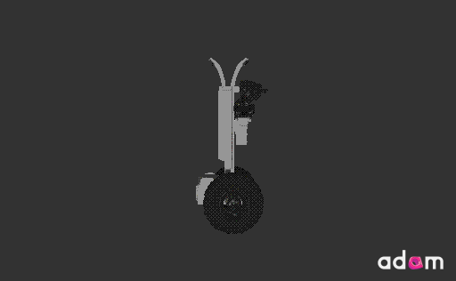
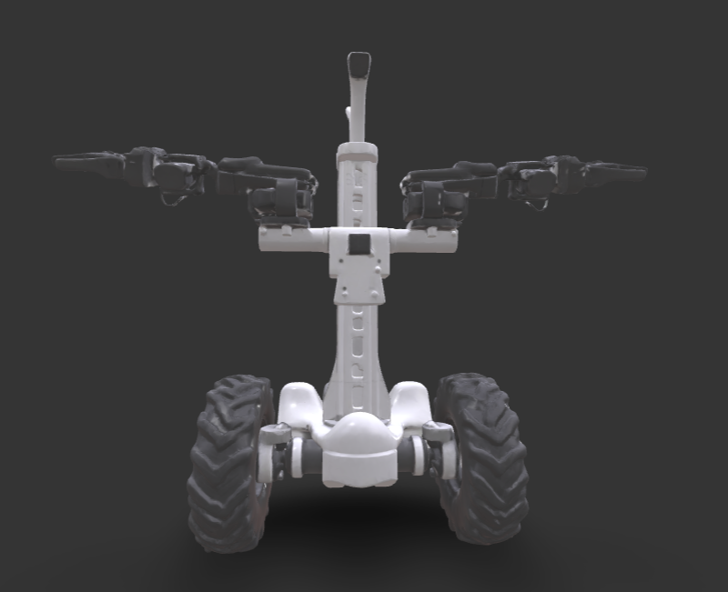
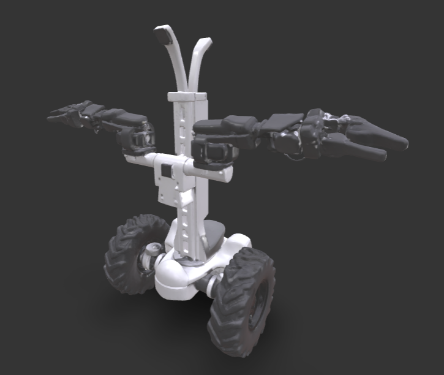
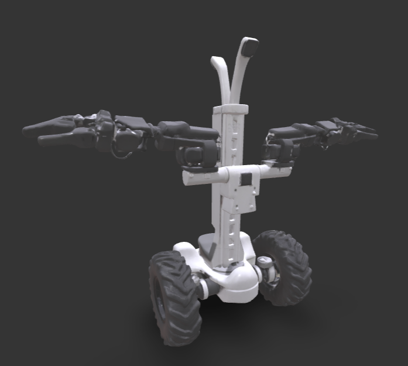

# Johnny 5: LeRobot inspired design

<div align="center">



<p align="center">
  
  
  
</p>

[](https://github.com/huggingface/lerobot)
[](https://www.python.org/)
[](https://docs.ros.org/en/humble/)
[](https://developer.nvidia.com/embedded/jetson-modules)
[](https://docs.luxonis.com/)
[](https://gun.eco/)

# Open-Source Mobile Manipulation : Choose Your Path
</div>

This repository hosts five distinct robot platforms derived from the LeKiwi/SO-ARM100 lineage and the WhoAmI intelligence stack. Whether you are an educator looking for an affordable teleoperation platform, a researcher building autonomous agents, or a developer deploying full humanoids or dual-arm manipulators, there is a path for you. Upgrade your existing LeKiwi, rebuild it entirely for real work, go full humanoid, or deploy sophisticated dual-arm systems.

**One Brain, Many Bodies:** All platforms share the same **[WhoAmI](https://github.com/alanchelmickjr/whoami)** intelligence layer—providing secure face recognition, voice interaction, and personal memory regardless of the physical form factor.

## 🤖 Path A: AlohaMini (The Entry Level - upgrade your LeKiwi!)
**"The Affordable Teleoperator"**

*   **Best For**: Education, Hobbyists, Teleoperation collection.
*   **Brain**: Raspberry Pi 5.
*   **Base**: 3-Wheel Omni-directional (3D printed).
*   **Vision**: Standard USB Webcams.
*   **Audio**: Standard USB Audio (Optional).
*   **Key Feature**: Low barrier to entry, highly documented assembly.
*   **Documentation**: [Assembly Guide](docs/hardware_assembly.md) | [BOM](docs/BOM.md) | [LeKiwi Upgrade Guide](docs/lekiwi_upgrade_guide.md)

## 🤖 Path B: Johnny 5 (The Autonomous Pro - Real Robot for Real Work)
**"Input! More Input!"**

*   **Best For**: AI Research, VSLAM, Outdoor Utility.
*   **Brain**: NVIDIA Jetson Orin Nano (8GB+).
*   **Base**: Differential Drive with Rubber Tires (Off-the-shelf).
*   **Vision**: Luxonis OAK-D S3 Pro (AI Depth Camera).
*   **Audio**: 4-Way Directional Mic Array + Speaker (Talks and Hears).
*   **Key Feature**: Rugged navigation, "Hanging Shoulder" arms (270° ROM), Towing capability.
*   **Documentation**: [Specification](docs/johnny5_spec.md) | [Migration Notes](docs/johnny5_migration_notes.md)

## 🤖 Path C: K-1 Booster (The Humanoid - Commercial Grade)
**"I am Alive!"**

*   **Best For**: Commercial Deployment, Human-Robot Interaction, Full Autonomy.
*   **Brain**: NVIDIA Jetson Orin NX (8GB+).
*   **Base**: 22-DOF Humanoid (Bipedal walking).
*   **Vision**: Intel RealSense / ToF (RGBD Spatial Awareness).
*   **Audio**: Full Array Microphone + Speaker (Natural Conversation).
*   **Key Feature**: Full-body capabilities, ROS 2 / Fast-DDS control, Privacy-first "WhoAmI" memory.
*   **Source Code**: See the **[Booster K1 Repository](https://github.com/alanchelmickjr/booster_k1)** (Currently in Alpha).

## 🤖 Path D: R2D3 (The Bimanual Specialist - Open Droids)
**"Two Hands are Better Than One"**

*   **Best For**: Dual-arm manipulation, Reception/Greeter tasks, Complex interaction.
*   **Brain**: NVIDIA Jetson (Xavier NX / Orin).
*   **Base**: Differential Drive (Woosh Chassis) with Lifting Torso.
*   **Vision**: Intel RealSense D435C.
*   **Audio**: Microphone Array (Fun M240) + Speaker.
*   **Key Feature**: Dual 7-DOF arms, Telescoping torso for variable height interaction.
*   **Source Code**: See the **[R2D3 ROS2 Repository](https://github.com/alanchelmickjr/R2D3_ros2)**.

## 🤖 Path E: XLeRobot (Practical Dual-Arm Mobile Home Robot)
**"Practical Embodied AI for <$700"**

*   **Best For**: Mobile Manipulation, Household Tasks, Low-Cost Entry.
*   **Brain**: Laptop / Jetson / Raspberry Pi.
*   **Base**: Custom Mobile Base (Dual-wheel).
*   **Vision**: Dual-eye RGB / RealSense RGBD.
*   **Key Feature**: 6-DOF Arms, Mobile Base, Teleoperation via VR/Xbox/Keyboard.
*   **Source Code**: See the **[XLeRobot Repository](https://github.com/Vector-Wangel/XLeRobot)**.
*   **Note**: This platform serves as an excellent low-cost alternative for mobile manipulation and runs the shared "WhoAmI" stack.

---

## 🧠 Universal Intelligence: WhoAmI
All platforms run the [WhoAmI](https://github.com/alanchelmickjr/whoami) software stack, ensuring code portability. This software also powers our specialized **Greeter Bot**, which runs on the **XLeRobot** and **R2D3** platforms as a dedicated reception/interaction agent.

*   **Voice**: Natural F5-TTS Neural Voice (talks like a human).
*   **Vision**: Face recognition (YOLO/DeepFace) and spatial awareness.
*   **Memory**: Gun.js decentralized, encrypted database (Robot-owned memory, no cloud).
*   **Security**: Hardware-backed encryption.
*   **Privacy**: "Opt-in" interaction philosophy.

---

## 📂 Repository Structure

### Hardware
*   `hardware/arms/`: Shared SO-ARM100 follower arm files (used by both).
*   `hardware/alohamini_base/`: 3D printed parts for the AlohaMini Omni-base.
*   `hardware/johnny5_base/`: Mounting plates and adapters for the Johnny 5 Differential Drive base.

### Software
*   `software/src/lerobot/robots/alohamini/`: Python drivers for AlohaMini (RPi5/Omni).
*   `software/src/johnny5/`: Python drivers for Johnny 5 (Jetson/Diff-Drive).

## 🚀 Getting Started
## 🐢 ROS 2 Integration
The AlohaMini now supports ROS 2 Humble via the `alohamini_ros2` wrapper.

**Features:**
*   **Base Control**: Subscribe to `/cmd_vel` (Twist) for omni-directional movement.
*   **Joint Feedback**: Publish `/joint_states` for all arms and wheels.
*   **Visualization**: Compatible with RViz for real-time monitoring.

**Usage:**
```bash
# 1. Source your ROS 2 installation
source /opt/ros/humble/setup.bash

# 2. Build the package
colcon build --packages-select alohamini_ros2
source install/setup.bash

# 3. Launch the node
ros2 launch alohamini_ros2 aloha.launch.py
```
See [Upgrade Paths](docs/upgrade_paths.md) for a detailed comparison and decision guide.

## 🗺️ Roadmap & Consolidation Strategy
**Goal**: Unified codebase for all platforms (AlohaMini, Johnny 5, K-1/XLeRobot, R2D3).

1.  **Step 1: Tie the Rope (Current Phase)**
    *   Align software stacks across repositories (`alohamini`, `whoami`, `booster_k1`, `R2D3_ros2`, `XLeRobot`).
    *   Ensure feature parity (Vision, Voice, Memory) across all hardware.
    *   "Keep them swinging together" - Synchronize development updates.

2.  **Step 2: Consolidate**
    *   Remove overlapping code.
    *   Merge into a single, modular monorepo.
    *   Unified installation and configuration for any supported robot.

### Upcoming Features
*   **Split Chassis Design**: We are developing a 2-piece interlocking chassis to support smaller 3D printers (currently requires >325mm bed).
*   **Johnny 5 Differential Drive**: Finalizing the off-the-shelf base integration.
*   **LeRobot Policy Training**: Releasing pre-trained weights for common household tasks.

### 🔭 Long-Term Vision
**"Autonomous Creation"**
We are building towards a future where agents can design and fabricate their own bodies in real-time.
*   **Self-Fabrication**: Robots capable of 3D scanning, designing, and printing their own tools and upgrades.
*   **Adaptive Embodiment**: Intelligence that can instantly adapt to new physical forms (wheels -> legs -> treads).
*   **Real-time Agent Deployment**: Cloud-based agents instantiating into physical bodies on demand.

## Acknowledgements
Originally based on [LeKiwi](https://github.com/TheRobotStudio/SO-ARM100) and the work of the LeRobot community.
