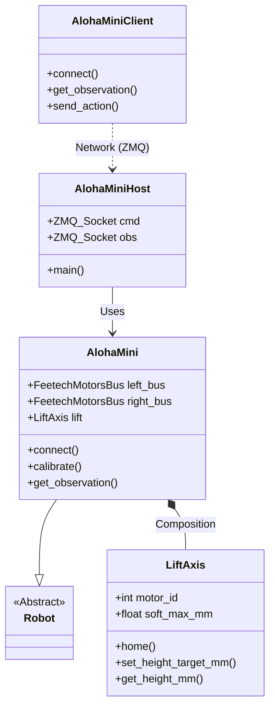

# Developer Notes: Refactoring & Architecture

## Architecture Diagram

## Refactoring Plan for "Dual Fork" Support

To support both **LeKiwi** (legacy/base) and **AlohaMini** (upgrade) from one codebase:

1.  **Renaming Campaign**:
    *   `LeKiwi` class -> `AlohaMini`
    *   `config_lekiwi.py` -> `config_alohamini.py`

2.  **Configuration Separation**:
    *   Introduce `AlohaMiniConfig` with a flag `is_lift_enabled` (or similar).
    *   If `False`: Acts as standard LeKiwi (3 omni wheels, 2 arms).
    *   If `True`: Initializes `LiftAxis` and includes it in observation space.

3.  **Upgrade Path Logic**:
    *   The "Upgrade Path" document will instruct users to:
        1.  Build LeKiwi.
        2.  Print Z-axis parts.
        3.  Install Z-axis & Servo ID 11.
        4.  Toggle `is_lift_enabled = True` in config.

4.  **Files to Modify**:
    *   `software/src/lerobot/robots/alohamini/lekiwi.py`: Rename to `alohamini_robot.py`.
    *   `software/src/lerobot/robots/alohamini/lekiwi_host.py`: Rename to `alohamini_host.py`.
    *   `software/src/lerobot/robots/alohamini/lekiwi_client.py`: Rename to `alohamini_client.py`.

## Action Items
- [ ] Rename python files to match `alohamini` branding.
- [ ] Refactor `LeKiwi` class to `AlohaMini`.
- [ ] Implement conditional logic for `LiftAxis` to support base LeKiwi.
- [ ] Create `docs/upgrade_path.md`.